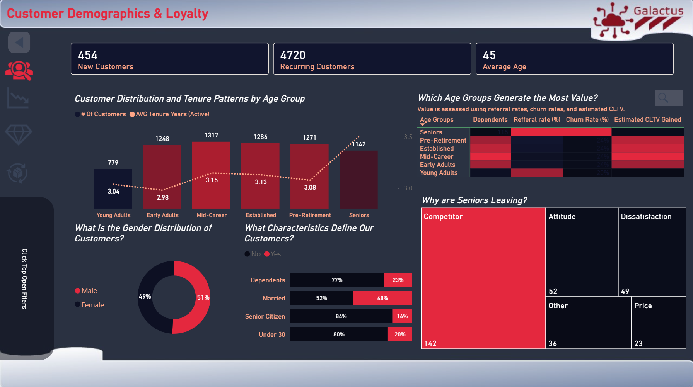
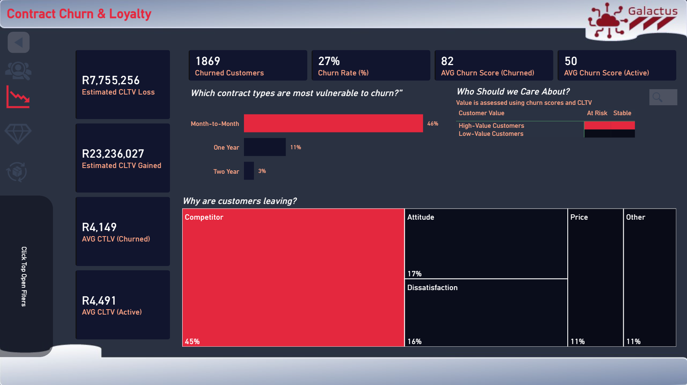
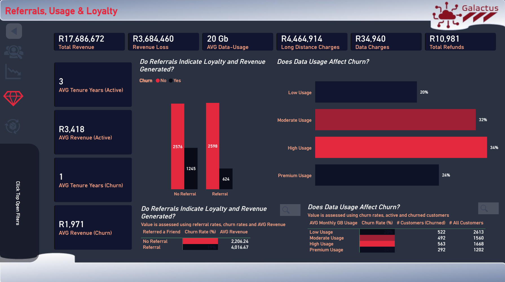
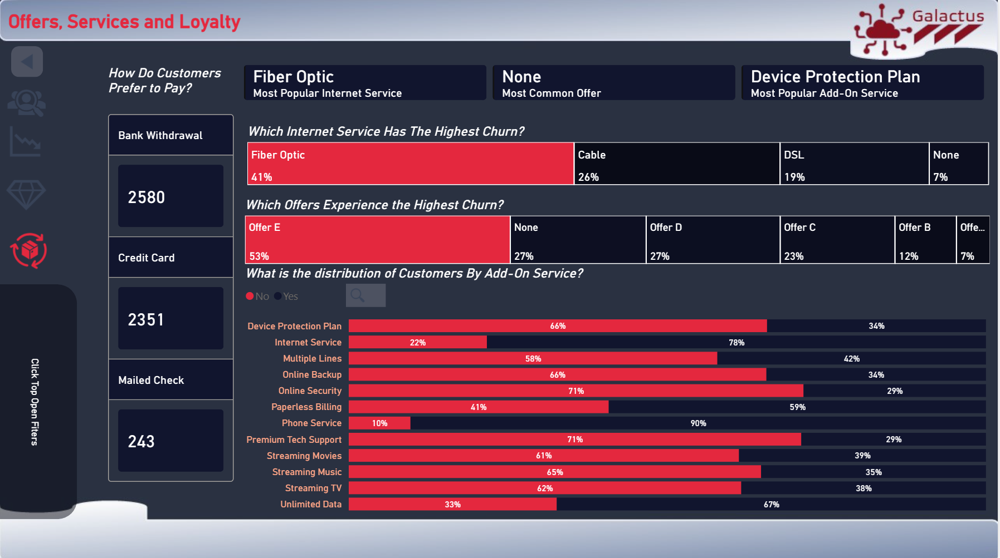

# Telecoms-customer-churn-dashboard
Power BI dashboard analysing telecom customer churn, loyalty, service adoption, customer demographics and revenue impact. The project uses DAX, data modelling, drill-through analysis and business storytelling to identify churn drivers and customer retention opportunities.

## Overview

This dashboard analyzes customer churn patterns and identifies factors contributing to customer attrition.

---

## Business Problem

The company needed to understand why customers were leaving and how churn could be reduced.

---

## Dataset

- 7,043 customers
- Telecom industry
- Contract, payment and service information

---

## 1. Dashboard Preview : Customer Demogrpahics & Loyalty 

---
## 2. Key Questions 
- *Who are our customers, which customers create value and which customers are at risk?*
- *Whats is the impact of churn and who should we worry about?*
- *Do refferals have an impact on churn?*
- *Which services are most popular and which have high churn?*

---

## 3. Key Insights 📈
###  3.1.1 Demographics and Loyalty
- Customer base is dominated by Mid-Career to Pre-Retirement customers, 23% of which have dependents.
- Customer distribution by gender is balanced.
- Seniors have the highest churn rate due to competition, the general trend applies for all customers.
###  3.1.2 Dashboard Preview 📊

###  3.2.1 Contract Churn and Loyalty
- Month-to-Month contracts experience the highest churn.
- Competitor offerings are the primary reason customers leave.
- High-value customers remain at significant risk.
###  3.2.2 Dashboard Preview 📊

###  3.3.1 Referrals, Usage and Loyalty
- Referral behaviour is strongly associated with loyalty.
- Customers who refer friends generate more revenue and churn less.
- Low and Premium usage customers have the lowest churn rate.
  ###  3.3.2 Dashboard Preview 📊

###  3.4.1 Offers, Services and Loyalty 
- Fiber Optic customers experience the highest service-related churn.
- Offer E customers exhibit the highest offer-related churn.
- Paperless Billing and Internet Service customers experience the highest churn among add-on services.
###  3.4.2 Dashboard Preview 📊

--- 
### 3.5 Summary Recommnendations💡
- Reduce churn among Month-to-Month and high-value customers.
- Use referrals and loyalty programmes to increase retention and customer value.
- Address competitor-driven churn through targeted offers, especially among Senior and Fiber Optic customer segments.
- Develop family oriented bundles.
---
## 3.6 *Detailed Recommendations 💡
###  3.6.1 Investigate Senior Customer Churn
*Although Senior customers have the longest average tenure and highest referral rates, they also experience the highest churn rates.*
- Conduct further analysis and customer surveys focused on Senior customers.
- Develop targeted retention packages tailored to their needs.
###  3.6.2 Investigate Senior Customer Churn
*The customer base is concentrated within Mid-Career, Established, and Pre-Retirement age groups, with 23% of customers having dependents.*
- Introduce family-oriented packages and bundled service offerings.
- Offer discounts for multi-user households.
###  3.6.3 Improve Retention of Month-to-Month Customers
*Month-to-Month customers exhibit a significantly higher churn rate (46%) compared to One-Year (11%) and Two-Year (3%) contract customers.*
- Introduce incentives for customers to migrate to longer-term contracts.
- Offer loyalty discounts, bundled services or reduced pricing for contract upgrades.
###  3.6.4 Prioritise High-Value Customers at Risk
*Nearly half of high-value customers are classified as at risk despite generating significant customer lifetime value.*
- Establish a proactive retention programme for high-value customers.
- Offer personalised loyalty benefits and account management services.
###  3.6.5 Strengthen Competitive Retention Strategies
*Competitor offerings account for approximately 45% of customer churn, making them the leading driver of customer attrition.*
- Conduct competitor benchmarking to identify gaps in pricing, service offerings and customer benefits
- Offer personalised loyalty benefits and account management services.
###  3.6.6 Strengthen Competitive Retention Strategies
*Customers who refer friends exhibit lower churn rates (19%) and generate significantly higher average revenue than customers who do not refer others.*
- Expand referral programmes and referral incentives.
- Offer personalised loyalty benefits and account management services.
###  3.6.7 Review Service and Offer Performance
*Fiber Optic customers exhibit the highest service-related churn, while customers associated with Offer E experience the highest offer-related churn.*
- Assess whether Offer E attracts higher-risk customer segments or contains service limitations.
- Offer personalised loyalty benefits and account management services.
###  3.6.8 Review Service and Offer Performance
*Premium Tech Support and Online Security exhibit the lowest churn rates among add-on services.*
- Bundle these services into customer retention packages.
---

## Author

**Tshepo Mooketsi**

Business Intelligence Analyst with 8 years of experience delivering analytics solutions across the telecommunications and retail industries. Passionate about transforming complex data into actionable business insights through data modelling, reporting, and visualization.

### Skills
- Power BI
- DAX
- Power Query
- Data Modelling
- Business Analysis
- Requirements Gathering
- Data Warehousing (EDW)

### Certifications
- Microsoft Certified: Power BI Data Analyst Associate (PL-300)

### Connect With Me
- LinkedIn: [Your LinkedIn Profile](https://linkedin.com/in/your-profile)
- GitHub: [Your GitHub Profile](https://github.com/your-username)

---
*Feel free to connect with me to discuss data analytics, business intelligence, and data-driven decision making.*
